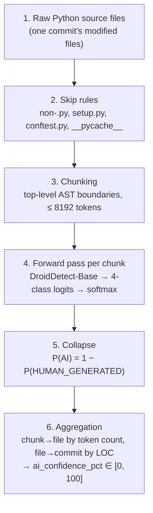

# Deltx AI Authorship Detection Module

## Overview

The detection module (Stage 2) addresses the *Invisibility Gap*: repositories
contain a growing share of LLM-generated code, and that share is invisible to
conventional quality metrics. For every commit, this module emits
`ai_confidence_pct ∈ [0, 100]` — 0 means high confidence the code is
human-written, 100 means high confidence it is LLM-generated. That scalar
occupies index `[4]` of the 15-dimensional commit vector consumed by the
PatchTST forecasting stage.

Detection uses **[DroidDetect-Base](https://huggingface.co/project-droid/DroidDetect-Base)**
(Apache-2.0), fine-tuned from ModernBERT-base on DroidCollection by Orel, Paul
et al., [*Droid: A Resource Suite for AI-Generated Code Detection*](https://arxiv.org/abs/2507.10583),
EMNLP 2025. Deltx neither trains nor re-benchmarks a detector; it wraps this
checkpoint and aggregates its output to the commit level.

## Architecture



```
src/deltx/detection/
├── models.py     # Pydantic models: DroidLabel, ClassDistribution, results
├── modeling.py   # TLModel architecture + strict checkpoint loading
├── detector.py   # Chunking and source → probability distribution
├── inference.py  # File → commit aggregation, skip rules
└── cli.py        # deltx-detect
```

## The checkpoint

The published repo ships `config.json`, `pytorch_model.bin`, and tokenizer files
— no modeling module and no `auto_map` — so `AutoModelForSequenceClassification`
cannot load it. `modeling.py` reconstructs the architecture and loads the weights
directly. Three facts were established by inspecting the artifact rather than by
reading its documentation:

| Fact | Value | Why it matters |
|------|-------|----------------|
| Projection width | **256**, not the 128 in `config.json` and the model card | Building to the documented value fails on a shape mismatch |
| Tensor layout | 138 tensors: `text_encoder.*` (134), `text_projection.*` (2), `classifier.*` (2) | No stray training-time keys, so `strict=True` loading is safe and preferred |
| Encoder keys | Exact match with upstream `answerdotai/ModernBERT-base` | The encoder is built from upstream config; upstream weights are never downloaded |

## Label semantics

| Index | Label | Meaning |
|-------|-------|---------|
| 0 | `HUMAN_GENERATED` | Human-authored |
| 1 | `MACHINE_GENERATED` | LLM-authored |
| 2 | `MACHINE_REFINED` | Human code an LLM rewrote |
| 3 | `MACHINE_GENERATED_ADVERSARIAL` | LLM output prompted to read as human |

`config.json` carries no `id2label`, so this order is **verified, not assumed**:
scoring 120 balanced Python rows from the DroidCollection *test* split gives a
clean diagonal (100% / 97% / 83% / 93% per class, 93.3% overall — against the
paper's reported 92.95). `tests/detection/test_checkpoint_integration.py` pins it,
because a reordering upstream would invert every score while all other tests
still passed.

## Scoring

```
ai_confidence_pct = 100 × (1 − P(HUMAN_GENERATED))
```

All three machine classes count as AI involvement, so collapsing them to the
complement of class 0 converts the noisy 4-way decision into the reliable
human-vs-machine one. Confusion *among* machine classes cannot move the score.
The full 4-way distribution is retained on every result for downstream stages.

The score is raw softmax mass, not a calibrated probability — treat it as an
ordinal confidence signal.

## Chunking is a correctness requirement

**Feed complete, top-level files. Never indented fragments.** Complete stdlib
modules score a median P(AI) of 0.026 (13/15 correctly human); the *same code*
extracted as indented methods via `inspect.getsource` scores ≈0.999. Leading
indentation and mid-scope truncation are out-of-distribution and produce
confident false positives.

Since 8 of 15 stdlib modules exceed the 8,192-token window, chunking is the
common case for library code, and a naive token window would start every chunk
after the first at arbitrary indentation. `split_into_chunks` therefore cuts on
top-level AST boundaries, falling back to a sliding window only when the source
does not parse or a single top-level block overflows the window.

Files under `min_tokens_to_score` (default 10) are left unscored: a
docstring-only `__init__.py` measured 98.98% AI, which is noise.

## Usage

```python
from datetime import UTC, datetime
from pathlib import Path

from deltx.common.config import DeltxConfig
from deltx.detection.inference import AIDetectionInference

detector = AIDetectionInference.from_config(DeltxConfig())

result = detector.analyze_file(source, Path("module.py"))
result.ai_confidence      # P(AI) in [0, 1]
result.distribution       # full 4-way ClassDistribution
result.is_scored          # False → excluded from commit aggregation

commit = detector.analyze_commit(
    files={Path("src/app.py"): source},
    commit_hash="a1b2c3d4",
    timestamp=datetime.now(UTC),
)
commit.ai_confidence_pct  # LOC-weighted, [0, 100]
```

```bash
poetry run deltx-detect analyze --file module.py
poetry run deltx-detect analyze-dir --dir src/my_package
```

Skipped automatically: non-`.py`, `setup.py`, `conftest.py`, and anything under
`__pycache__`. Unscored files are excluded from the commit average rather than
counted as 0.0; a commit with nothing scorable scores 0.0.

## Configuration

`DeltxConfig` is a Pydantic `BaseSettings`; every field is overridable via a
`DELTX_`-prefixed environment variable or `.env` (e.g. `DELTX_DEVICE=cuda`).

| Field | Default | Purpose |
|-------|---------|---------|
| `detector_repo` | `project-droid/DroidDetect-Base` | Detector checkpoint |
| `encoder_repo` | `answerdotai/ModernBERT-base` | Config source for the encoder container |
| `model_cache_dir` | `data/models/droiddetect` | Local artifact cache |
| `device` | `auto` | CUDA when available, else CPU |
| `max_sequence_length` | `8192` | Context window; clamped to the encoder's native maximum |
| `chunk_stride` | `4096` | Fallback window step for oversized top-level blocks |
| `min_tokens_to_score` | `10` | Below this, a file is left unscored |
| `random_seed` | `42` | Seeds any sampling |

There is deliberately **no batch-size setting**. The model pools with an unmasked
mean over every position, so padding changes each batch member's prediction;
scoring is one sequence per forward pass to keep results independent of batch
composition. `test_scoring_is_independent_of_batch_composition` asserts that
padding really does change the output.

## Testing

```bash
poetry run pytest              # default suite; no downloads, detector mocked
poetry run pytest -m slow      # real weights (~600 MB first run)
```

## Inherited limitations

Adopting a published detector means adopting its failure modes: degraded accuracy
on domains and generator families outside the training distribution, vulnerability
to adversarial humanization, and possible AI-assisted code mislabelled as human in
its training data. Residual false positives on ordinary human code are real —
`csv.py` scored 0.989 and `queue.py` 0.516 out of 15 stdlib modules. Read
`ai_confidence_pct` as a trend signal across a commit history, not a verdict on a
single commit.
