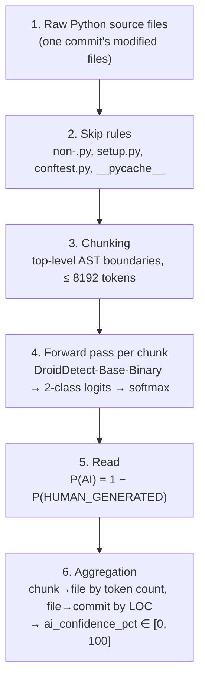

# Deltx AI Authorship Detection Module

## Overview

The detection module (Stage 2) addresses the *Invisibility Gap*: repositories
contain a growing share of LLM-generated code, and that share is invisible to
conventional quality metrics. For every commit, this module emits
`ai_confidence_pct ∈ [0, 100]` — 0 means high confidence the code is
human-written, 100 means high confidence it is LLM-generated. That scalar
occupies index `[4]` of the 15-dimensional commit vector consumed by the
PatchTST forecasting stage.

Detection uses **[DroidDetect-Base-Binary](https://huggingface.co/project-droid/DroidDetect-Base-Binary)**
(Apache-2.0), fine-tuned from ModernBERT-base on DroidCollection by Orel, Paul
et al., [*Droid: A Resource Suite for AI-Generated Code Detection*](https://arxiv.org/abs/2507.10583),
EMNLP 2025. Deltx neither trains nor re-benchmarks a detector; it wraps this
checkpoint and aggregates its output to the commit level.

The suite publishes binary, ternary, and four-class heads. Deltx uses the binary
one: it is the most reliable of the three by a wide margin (99.18 weighted F1
against 94.36 and 92.95), and Stage 2 needs a single scalar, so a finer head's
extra classes would be summed together on arrival regardless. The binary head
folds machine-refined code in with generated code during *training* rather than
after the fact.

## Architecture



```
src/deltx/detection/
├── models.py     # Pydantic models: DroidLabel, ClassDistribution, results
├── modeling.py   # TLModel architecture + strict checkpoint loading
├── detector.py   # Chunking and source → probability distribution
├── inference.py  # File → commit aggregation, skip rules
└── cli.py        # deltx-detect
```

## The checkpoint

The published repo ships `config.json`, `pytorch_model.bin`, and tokenizer files
— no modeling module and no `auto_map` — so `AutoModelForSequenceClassification`
cannot load it. `modeling.py` reconstructs the architecture and loads the weights
directly. Three facts were established by inspecting the artifact rather than by
reading its documentation:

| Fact | Value | Why it matters |
|------|-------|----------------|
| Projection width | **256**, not the 128 in `config.json` and the model card | Building to the documented value fails on a shape mismatch |
| Tensor layout | 272 tensors: `text_encoder.*` (134), `additional_loss.*` (134), `text_projection.*` (2), `classifier.*` (2) | The training-time triplet loss ships in the export and must be filtered before loading |
| Encoder keys | Exact match with upstream `answerdotai/ModernBERT-base` | The encoder is built from upstream config; upstream weights are never downloaded |

`additional_loss.sentence_embedder.*` is the triplet loss's reference to the
encoder, serialised alongside it — 134 keys that alias the *same* storages, which
is why the file is 569 MB rather than double that. `load_detector` drops the
prefix and loads the remaining 138 tensors with `strict=True`. Strictness is kept
deliberately: filtering one known prefix still proves every projection and
classifier weight came from the checkpoint, which a blanket `strict=False` would
not.

## Label semantics

| Index | Label | Meaning |
|-------|-------|---------|
| 0 | `HUMAN_GENERATED` | Human-authored |
| 1 | `MACHINE_GENERATED` | Any AI involvement — generated, refined, or adversarial |

Class 1 is broad by construction: the binary setup maps the ternary labels
(human-written, AI-generated, AI-refined) onto two targets, so code an LLM
rewrote is a class-1 training example rather than a category Deltx drops.

`config.json` carries no `id2label`, and the model card's
`{"0": "HUMAN_GENERATED", "1": "MACHINE_GENERATED"}` comes from the same card
that misstates the projection width — corroboration, not proof.
`tests/detection/test_checkpoint_integration.py` pins the order against real
weights: pre-LLM stdlib modules must land on index 0, known-LLM source on index
1, and the two must be separated by a wide margin rather than both hovering at
the boundary. A reordering upstream would invert every score while all other
tests still passed.

## Scoring

```
ai_confidence_pct = 100 × (1 − P(HUMAN_GENERATED))
```

Equivalently `100 × P(MACHINE_GENERATED)`, written as the complement so the
definition stays anchored to the class whose meaning is directly verified. This
is the detector's most reliable decision (99.18 weighted F1), and because refined
code is folded into class 1 during training, no confusion between kinds of AI
involvement can move the score. The full distribution is retained on every result.

The score is raw softmax mass, not a calibrated probability — treat it as an
ordinal confidence signal.

Downstream stages get no separate `MACHINE_REFINED` channel; the binary head does
not distinguish refinement from generation, and that cannot be recovered from a
stored result.

## Chunking is a correctness requirement

**Feed complete files. Never short fragments.** Fifteen complete stdlib modules
score a median P(AI) of 0.198 (13/15 correctly human). Forty methods extracted
from eight of those same modules via `inspect.getsource` score a median of 0.604,
23/40 of them over the threshold. Same code, served in pieces, 4.5× the
false-positive rate.

| Input | median P(AI) | false positives |
|-------|--------------|-----------------|
| Complete modules (15) | 0.198 | 2/15 |
| Method fragments (40) | 0.604 | 23/40 |
| The same fragments, dedented | 0.831 | 29/40 |

That third row matters: **indentation is not the cause.** Removing it makes the
score worse, so dedenting is not a mitigation. The model reacts to a short unit
torn out of its context — which is what an LLM is typically asked to produce.

Since 10 of those 15 modules exceed the 8,192-token window, chunking is the
common case for library code, and every chunk after the first is a fragment by
construction. `split_into_chunks` therefore cuts on top-level AST boundaries — 
keeping chunks as large and self-contained as it can — and falls back to a
sliding window only when the source does not parse or a single top-level block
overflows the window. Prefer fewer, larger chunks; treat a chunk that could not
be top-level-aligned as suspect.

Files under `min_tokens_to_score` (default 10) are left unscored, because below
that length the score is erratic rather than merely uncertain: a docstring-only
`__init__.py` measures 0.406, a single `from .core import Widget` measures 0.981,
and a two-line `pass` stub 0.978. Nothing distinguishes those inputs in kind, so
none of the three numbers means anything.

## Usage

```python
from datetime import UTC, datetime
from pathlib import Path

from deltx.common.config import DeltxConfig
from deltx.detection.inference import AIDetectionInference

detector = AIDetectionInference.from_config(DeltxConfig())

result = detector.analyze_file(source, Path("module.py"))
result.ai_confidence      # P(AI) in [0, 1]
result.distribution       # ClassDistribution over the two labels
result.is_scored          # False → excluded from commit aggregation

commit = detector.analyze_commit(
    files={Path("src/app.py"): source},
    commit_hash="a1b2c3d4",
    timestamp=datetime.now(UTC),
)
commit.ai_confidence_pct  # LOC-weighted, [0, 100]
```

```bash
poetry run deltx-detect analyze --file module.py
poetry run deltx-detect analyze-dir --dir src/my_package
```

Skipped automatically: non-`.py`, `setup.py`, `conftest.py`, and anything under
`__pycache__`. Unscored files are excluded from the commit average rather than
counted as 0.0; a commit with nothing scorable scores 0.0.

## Configuration

`DeltxConfig` is a Pydantic `BaseSettings`; every field is overridable via a
`DELTX_`-prefixed environment variable or `.env` (e.g. `DELTX_DEVICE=cuda`).

| Field | Default | Purpose |
|-------|---------|---------|
| `detector_repo` | `project-droid/DroidDetect-Base-Binary` | Detector checkpoint |
| `encoder_repo` | `answerdotai/ModernBERT-base` | Config source for the encoder container |
| `model_cache_dir` | `data/models/droiddetect` | Local artifact cache |
| `device` | `auto` | CUDA when available, else CPU |
| `max_sequence_length` | `8192` | Context window; clamped to the encoder's native maximum |
| `chunk_stride` | `4096` | Fallback window step for oversized top-level blocks |
| `min_tokens_to_score` | `10` | Below this, a file is left unscored |
| `random_seed` | `42` | Seeds any sampling |

There is deliberately **no batch-size setting**. The model pools with an unmasked
mean over every position, so padding changes each batch member's prediction;
scoring is one sequence per forward pass to keep results independent of batch
composition. `test_scoring_is_independent_of_batch_composition` asserts that
padding really does change the output.

## Testing

```bash
poetry run pytest              # default suite; no downloads, detector mocked
poetry run pytest -m slow      # real weights (569 MB first run)
```

The offline guarantee comes from `-m 'not slow'` in `addopts`, not from the
marker itself — a marker alone deselects nothing.

## Inherited limitations

Adopting a published detector means adopting its failure modes: degraded accuracy
on domains and generator families outside the training distribution, vulnerability
to adversarial humanization, and possible AI-assisted code mislabelled as human in
its training data. Residual false positives on ordinary human code are real — of
15 complete stdlib modules, `heapq.py` scored 0.769 and `queue.py` 0.540. Read
`ai_confidence_pct` as a trend signal across a commit history, not a verdict on a
single commit.
