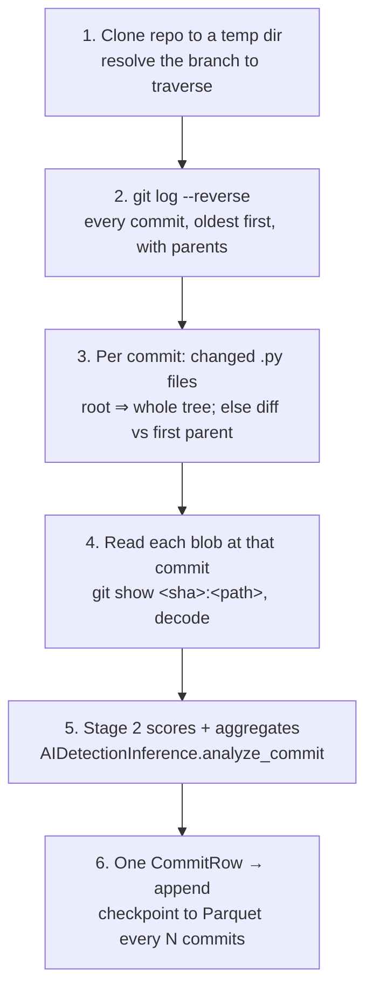

# Deltx History Extraction Module

## Overview

The extraction module (Stage 1) turns a Git repository into the table the
forecasting stage reads. It clones a repository, walks **every** commit on the
primary branch oldest-first, scores the Python files each commit added or
modified through the Stage 2 detector, and writes one row per commit to a
Parquet file — carrying that commit's LOC-weighted `ai_confidence_pct`, the
scalar that becomes index `[4]` of the 15-D commit vector.

Two invariants make the output usable downstream, and both are load-bearing:

- **Continuous Ordinal Sampling.** No commit is skipped. A commit that touched
  no Python files still gets a row, so the series has no gaps for the
  time-series model to trip over.
- **Chronological order.** Commits are emitted oldest-first (`commit_index` 0 is
  the oldest), because the forecasting stage reads the series as a sequence.

Stage 1 owns none of the scoring. Skip rules, chunking, per-file scoring, and
the LOC-weighted aggregation into `ai_confidence_pct` all live in
`deltx.detection` and are reused unchanged. This module's job is everything the
detector never sees: cloning, traversal, deciding which files a commit changed,
and shaping the result — including the commits that changed no Python at all.

## Architecture



```
src/deltx/extraction/
├── git_history.py   # clone, branch resolve, commit traversal, changed-file detection, blob decode
├── models.py        # CommitRow — the output schema, as a Pydantic model
├── pipeline.py      # per-commit orchestration → CommitRow
└── cli.py           # deltx-extract
```

## CLI

```bash
python extract_ai_confidence.py \
  --repo-url https://github.com/user/repo.git \
  --output results/repo_ai_confidence.parquet \
  --branch main \
  --device cuda
```

Equivalent installed entry point: `poetry run deltx-extract …`.

| Option | Required | Default | Purpose |
|--------|----------|---------|---------|
| `--repo-url` | yes | — | Git clone URL |
| `--output` | yes | — | Destination Parquet path; the run log is written beside it as `.log` |
| `--branch` | no | primary branch | Branch to traverse; falls back to `origin/<branch>` |
| `--device` | no | `auto` | Torch device (`auto` picks CUDA when available) |
| `--resume` | no | — | Existing partial Parquet to continue from |
| `--verbose` | no | off | Debug logging |

> **There is deliberately no `--batch-size`.** DroidDetect pools with an
> unmasked mean over every token position, so padding a batch changes each
> member's prediction — the detection module scores one sequence per forward
> pass for exactly this reason, and `test_scoring_is_independent_of_batch_composition`
> pins it. A batch-size knob here would either do nothing or silently corrupt
> scores, so it is omitted rather than faked. Throughput comes from the device,
> not from batching.

## Output schema

One row per commit, columns in this fixed order (see
`EXTRACTION_COLUMNS`):

| Column | Type | Description |
|--------|------|-------------|
| `repo_url` | string | The repository URL, verbatim |
| `commit_hash` | string | Full 40-char SHA |
| `commit_timestamp` | datetime (UTC) | Author timestamp, timezone-normalised |
| `commit_author` | string | Author name |
| `commit_message` | string | First line of the commit message |
| `commit_index` | int64 | 0-based position, 0 = oldest |
| `files_changed_py` | int64 | `.py` files added or modified in the commit |
| `total_loc_scored` | int64 | Lines of code across the files actually scored |
| `ai_confidence_pct` | float64 | LOC-weighted AI confidence `[0, 100]`, or `NaN` |
| `file_scores_json` | string | `{path: {"score", "loc"}}` over scored files, for traceability |

`file_scores_json` records each scored file's `P(AI)` in `[0, 1]` — the quantity
the aggregate weights — not the percentage. Keys are POSIX-relative paths so the
column is portable across platforms.

## Git traversal

Commits and their metadata come from a single `git log --reverse` pass
(equivalent to `git rev-list --reverse`, but timestamp, author, subject, and
parents come along for free). File contents are then read by blob address —
`git show <sha>:<path>` — rather than by checking each commit out into the
working tree. A thousand-commit history is a thousand checkouts of filesystem
churn otherwise; reading blobs is byte-identical, mutates nothing, and leaves a
`--resume` run safe to interrupt at any moment.

Which files a commit "changed" depends on its position:

- **Root commit** (no parent): every `.py` file in the tree is an addition —
  `git ls-tree -r`.
- **Every other commit**: `git diff --name-status --find-renames` against the
  **first parent**. Merges therefore reflect only what they introduced to the
  mainline, not everything from the merged-in side.

Status codes map to scoring as follows: `A`/`M`/`T` contribute their path; a
deletion (`D`) has no content to score and is excluded; a pure rename (`R100`,
identical content) is excluded; a rename or copy that also changed content
(`R<100`, `C<100`) contributes its **destination** path.

## Edge cases

| Case | Handling |
|------|----------|
| First commit | No parent — whole tree treated as added |
| Merge commit | Diffed against first parent only |
| No `.py` changed | Row still recorded; `files_changed_py = 0`, `ai_confidence_pct = NaN` |
| Deleted file | Excluded (nothing to score) |
| Empty `.py` | Counted in `files_changed_py`, but 0 LOC so excluded from scoring |
| Binary / undecodable `.py` | Skipped with a warning; counted as changed, not scored |
| Renamed only | Excluded; renamed **and** modified scores the new path |
| Oversized file | Chunked on top-level AST boundaries by Stage 2, then scored — not truncated |
| Encoding | UTF-8 first, latin-1 fallback, then skipped as binary |

`ai_confidence_pct` is `NaN` whenever nothing was scored — a commit with no
changed `.py`, or one whose changed files were all empty, binary, or
undecodable. `NaN` is deliberate: a commit with no evidence must not enter the
series as a confident `0.0` "human" signal. Downstream code should treat these
as missing, not as zero.

## Resume

`--resume <partial.parquet>` loads the already-computed rows, collects their
commit hashes, and skips re-scoring them while walking the full history — so
`commit_index` stays a stable, global position regardless of where a run was
interrupted. The output is checkpointed every `CHECKPOINT_INTERVAL` (25) commits
via an atomic write (temp file then rename), so an interrupted run always leaves
a valid Parquet to resume from rather than a half-written one.

This matters because bulk runs are long: see below.

## Performance

Inherited straight from Stage 2. On the CPU-only development machine the
detector runs at roughly **2.5 commits/min**, and cost grows superlinearly with
file length (attention is quadratic), so large files dominate. A 1,000-commit
history is therefore ~6–7 hours on CPU — the module is built to run in a GPU
notebook for bulk work, with `--resume` making it safe to do so in chunks. The
local CPU path is for development and small repositories.

## Testing

```bash
poetry run pytest tests/extraction        # real git, mocked detector — no download
```

The tests script real Git repositories (fast, offline, deterministic) to
exercise traversal, rename detection, merges, encoding fallbacks, aggregation,
Parquet round-trips, and resume. Only the DroidDetect checkpoint is faked, so
the clone, diff, scoring-orchestration, and write paths all run for real without
the 569 MB download — the same offline guarantee the detection suite keeps.
